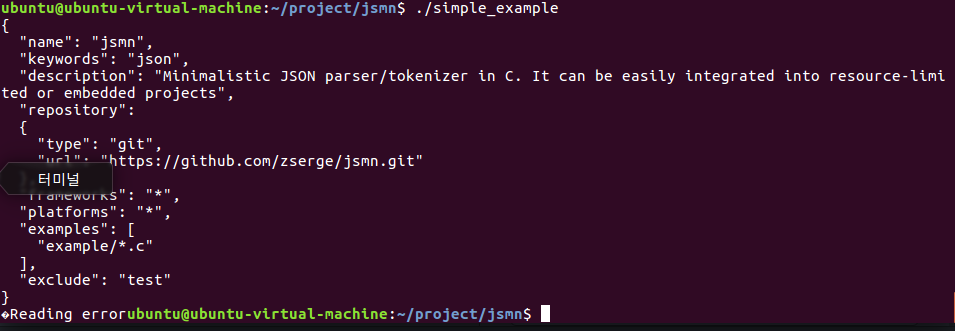

Example1
---------
1. <pre><code>sudo git clone https://github.com/priscilla5328/jsmn</code></pre>
2. <pre><code>mkdir mysource</code></pre>
3. <pre><code>cp ./example/simple.c ./mysource/filesimple.c</code></pre>
4. <pre><code>simple_example :  mysource/filesimple.o libjsmn.a</code></pre>
5. <pre><code>make simpme_example
   ./simple_example
   git add .
   git commit</code></pre>

Example2 
---------
1. <pre><code>mv library.json data.json</code></pre>
2. <pre><code>char *readJSONFile() {
      long Fsize;
      char* buffer;
      size_t result;
      FILE* fp;
      
      fp = fopen("data.json", "r");
      if( fp == NULL ) {
         printf("Error\n");
         exit(1);
      }
      
      while(!feof(fp)){
         printf("%c", fgetc(fp));
      }
      
      fseek(fp, 0, SEEK_END);
      Fsize = ftell(fp) + 1;
      rewind(fp);
      
      buffer = (char*)malloc(sizeof(char)*Fsize)+1;
      if(buffer == NULL ){
         fputs("Memory error", stderr);
         exot(2);
      }
      
      result = fread(buffer, 1, Fsize, fp);
      if(result != Fsize){
         printf("Reading Error");
         exit(3);
      }
      
      fclose(fp);
      free(buffer);
      return result;
   }</code></pre>
   
Example3
--------------

main code
<pre><code>
   char* JSON_STRING
   JSON_STRING = readJSONFile();</pre></code>
   

