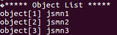

Example 7
-------------
<pre><code> if (r < 1 || t[0].type != JSMN_ARRAY) {
        printf("Array expected\n");
        return 1;
    }
</code></pre>
t[0].type을 array로 지정해서 가장 top-level의 type을 object에서 array로 바꿔준다

Example 8
-------------
<pre><code>void printObjectList(char* jsonstr, jsmntok_t *t, int tokcount, int *nameTokIndex){
    printf("***** Object List *****\n");
    int a=0, b=0;

    for (a=0; a < tokcount; a++){
    if(t[a].size == 8){ //size가 8일때 각각의 object의 name을 알 수 있으나 json파일의 내용이 달라지면 적용이 힘듦
      nameTokIndex[b]=a;
      printf("object[%d] %.*s\n", b+1, t[a+2].end-t[a+2].start, jsonstr+t[a+2].start); //name의 이름을 가져오기 위해 2를 더함       
      b++;
    }
    nameTokIndex[b]=a+1;    
  }
}</code></pre>

Example 9
------------
<pre><code>void selectObjectList(char* jsonstr, jsmntok_t *t, int* nameTokIndex, char* obj){
    int no;

    obj = (char *)malloc(sizeof(char)); //main함수에서 받아온 포인터배열에 동적할당을 한다

    while(1){
        printf("Select Object's NO (exit:0) >> ");
        scanf("%d", &no);

        if(no == 0 || (t[nameTokIndex[no-1]].end < t[nameTokIndex[no-1]].start)){ //0을 눌렀을 때와 내용의 끝이 처음보다 앞에 있을때 break
            break;
        }else if(nameTokIndex[no-1] != 0){

            obj = (char *)realloc(obj, t[nameTokIndex[no-1]].end-t[nameTokIndex[no-1]].start); //realloc을 사용해 object의 길이만큼 메모리를 할당한다
            strncpy(obj, jsonstr+t[nameTokIndex[no-1]].start, t[nameTokIndex[no-1]].end-t[nameTokIndex[no-1]].start); //재할당한 메모리에 object의 내용을 복사한다

            printf("%.*s\n", t[nameTokIndex[no-1]].end-t[nameTokIndex[no-1]].start, obj);
            
        }
    }
}</code></pre>

