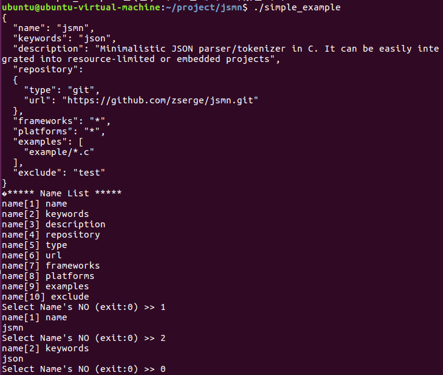

Example 4, 5
--------
**jsonNameList함수에서 Name이 있는 token index를 저장**
<pre><code> void jsonNameList(char* jsonstr, jsmntok_t *t, int tokcount, int *nameTokIndex){
  int a=0, b=0, count=0;

    for (a=0; a < tokcount; a++){a
     if((t[a].size == 1) && (t[a].type != JSMN_OBJECT) && (t[a].type != JSMN_ARRAY)){ //array나 object전체가들어가면 안되므로 조건문을 설정해준다
      nameTokIndex[b]=a;
      count++;
      b++;
    }
    nameTokIndex[b]=a+1; //마지막 name 할당
   }

  }
</code></pre>

__printNameList함수에서 NameList를 출력__
<pre><code>void printNameList(char* jsonstr, jsmntok_t *t, int *nameTokIndex){
  int i=0;

  printf("***** Name List *****\n");
  while(1){
    if(nameTokIndex[i] == 0){
      break; //nameTokIndex가 없으면 출력을 하지 않는다
    }
    else if(nameTokIndex[i] != 0){
      printf("name[%d] %.*s\n", i+1, t[nameTokIndex[i]].end - t[nameTokIndex[i]].start, jsonstr + t[nameTokIndex[i]].start);
      i++; //있으면 출력
      if(jsonstr + t[nameTokIndex[i]].start == jsonstr){ //[name11]이 출력되는 것 방지
        break;
      }
    }
  }
}
</code></pre>

Example6
----------
__Name no 선택시 value를 출력__
<pre><code>void selectNameList(char* jsonstr, jsmntok_t *t, int* nameTokIndex){
  int no, i;

  while(1){
    printf("Select Name's NO (exit:0) >> ");
    scanf("%d", &no);

    if(no == 0){ //0선택시 exit
      break;
    }
    else if((nameTokIndex[no-1] != 0) && (nameTokIndex[no] != 0)){
      printf("name[%d] %.*s\n", no, t[nameTokIndex[no-1]].end-t[nameTokIndex[no-1]].start, jsonstr+t[nameTokIndex[no-1]].start);
      printf("%.*s\n", t[nameTokIndex[no]-1].end-t[nameTokIndex[no]-1].start, jsonstr+t[nameTokIndex[no]-1].start);
    }
  }
}
</code></pre>

