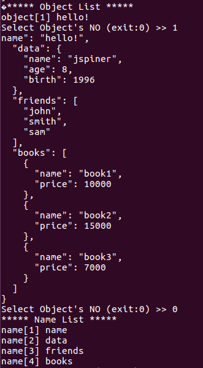
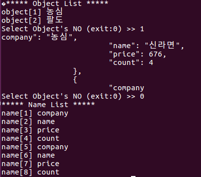

Example 10
-----------

Example 11
----------

고친 코드
jsmnNameList()
<pre><code>for (a=0; a < tokcount; a++){
        if(t[a+1].type == JSMN_ARRAY || t[a+1].type == JSMN_OBJECT){
            parentnum++;
        } else if(t[a+1].type != JSMN_ARRAY || t[a+1].type != JSMN_OBJECT){
            break;
        }
      }
      for(a=1, b=0; a < tokcount; a++){
    if(t[t[a].parent].parent == parentnum){ //구하고자하는 parent를 구해서 parent의 parent가 같은 것들을 출력하도록 한다
      nameTokIndex[b]=a;
      b++;           
    }
    
    }</code></pre>
