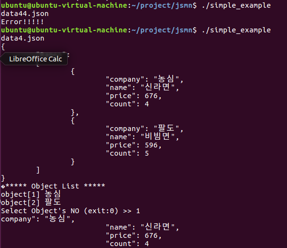
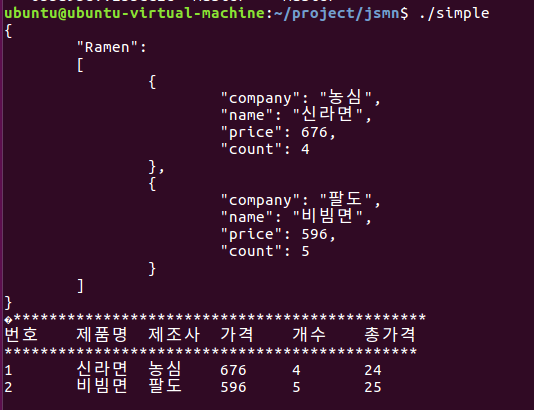
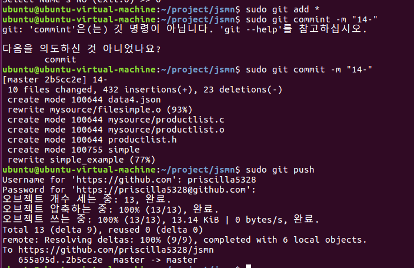

Example 12
-----------

파일이름을 입력 받는다
    <pre><code>scanf("%s", filename);
    fp = fopen(filename, "rt");</code></pre>

data4.json파일을 따로 처리한다
<pre><code> if(strcmp(filename, "data4.json") == 0){
        parentnum = 1;
        for (a=2; a < tokcount; a++){
            //printf("parent:%d\n", t[a].parent);
            if(t[a+1].type == JSMN_ARRAY || t[a+1].type == JSMN_OBJECT){
                parentnum++;
            } else if(t[a+1].type != JSMN_ARRAY || t[a+1].type != JSMN_OBJECT){
                //printf("size %d\n", t[a].size);
                oidx = t[a].size;
                break;
            }
        }
    } 
     if(strcmp(filename, "data4.json")==0){
        for(i=0; i < tokcount; i++){
            //parent = 1;
            if(t[i+1].type == JSMN_STRING && t[i+2].type == JSMN_ARRAY){
                parent++;
                continue;
            }
            if(t[i+1].type == JSMN_ARRAY || t[i+1].type == JSMN_OBJECT){
                parent++;
            }else if(t[i+1].type != JSMN_ARRAY || t[i+1].type != JSMN_OBJECT){
                break;
            }
        }
        parentnum = parent;
    }</code></pre>

Example 14
----------

<pre><code> for(a=1, b=0; a < tokcount; a++){
            if(t[a].parent == parent){
                nametokenInfo[b].objectindex = b+1;
                nametokenInfo[b].tokindex = a;

                for(m=0; m < (t[a+6].end-t[a+6].start); m++){
                    beforePrice[b][m]=jsonstr[t[a+6].start + m];
                } //여기에서 물건 가격의 맨 앞자리밖에 구해지지 않는데 아직 이유를 모르겠다

                for(n=0; n < (t[a+8].end-t[a+8].start); n++){
                    beforeCount[b][n]=jsonstr[t[a+8].start + n];
                }//개수 

                afterPrice[b] = atoi(beforePrice[b]);
                afterCount[b] = atoi(beforeCount[b]); //연산을 위해 integer로 변환
                totalPrice[b] = afterPrice[b]*afterCount[b];

                //printf("Price %s \n", beforePrice[b]);

                printf("%d\t%.*s", b+1, t[a+4].end - t[a+4].start, jsonstr + t[a+4].start);
                printf("\t%.*s", t[a+2].end - t[a+2].start, jsonstr + t[a+2].start);
                printf("\t%.*s", t[a+6].end - t[a+6].start, jsonstr + t[a+6].start);
                printf("\t%.*s", t[a+8].end - t[a+8].start, jsonstr + t[a+8].start);
                printf("\t%d\n", totalPrice[b]);

                b++;
            }
        }</code></pre>

Git upload
------------

