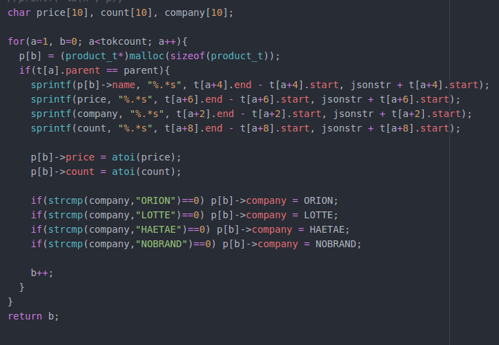

Example 15(1)
-----------

Example 15(2)
----------

Example 15(3)
-----------

sprintf로 json파일에서 얻고자 하는 값을 가져온다
product_t에 int로 저장된 항목들은 sprintf로 가져올때 string이므로 atoi를 이용해서 int로 변환한다

Example 15(4)
-----------

makeProduct()에서 return받은 구조체의 개수만큼 반복문을 사용해 값을 출력
