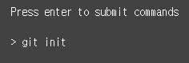
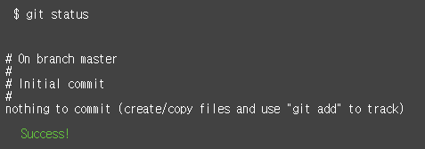
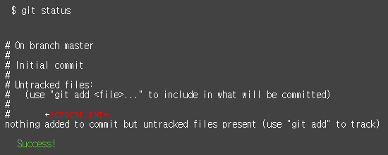
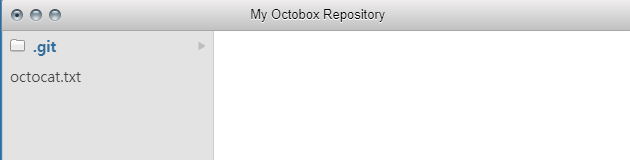
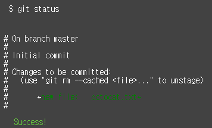
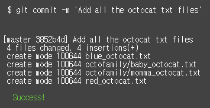

Try Github 정리
===============
1. git init
> Git repository 생성

------------------------------
2. git status
> 현재 상태를 확인한다
> commit할 파일 없음

-------------------------------
3. git status
> 현재 상태를 확인한다
> untracked 파일 octocat.txt을 볼 수 있다

-------------------------------
3. git add octocat.txt
> otcocat.txt 파일을 추적한다

----------------------------------
4. git status
> git status로 현재 상태를 확인하면 'changes to be commited' 되어있다
> 'changes to be commited'는 octocat.txt파일이 tracked 상태이면서 커밋에 추가될 staged 상태라는 뜻이다

--------------------------------------------------------------------------------------------------------
5. git commit -m "Add cute octocat story"
> 준비 영역에서 변경 내역을 저장소로 저장하기 위해서 남길 메세지와 함께 commit 명령어를 사용한다

-----------------------------------------------------------------------------------------------
6. git add '*.txt'

> 모든 txt파일을 추적한다

--------------------------------
7. git commit -m 'Add all the octocat txt files'
> 준비 영역에서 변경 내역을 저장소로 저장하기 위해서 남길 메세지와 함께 commit 명령어를 사용한다

--------------------------------------------------------------------------------------------
8. git log
> commit된 모든 변경 사항에 대한 기록이다

